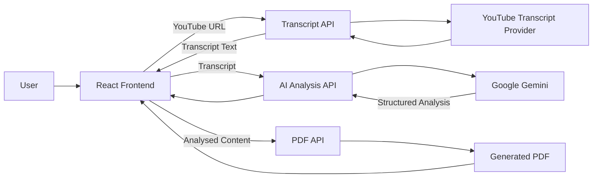

# AI Video Summarizer

A full-stack web application that extracts transcripts from YouTube videos,
uses generative AI to transform them into structured learning notes, and
allows users to copy or export the generated content.

## Live Application

[Open AI Video Summarizer](https://ai-video-summarizer-frontend.vercel.app)

> The application works only with YouTube videos for which transcript data
> is available.

## Overview

Long-form videos often contain useful information that is difficult to
review quickly.

AI Video Summarizer simplifies that process by allowing a user to:

1. Submit a YouTube video URL.
2. Extract the available video transcript.
3. Read the transcript in a paginated interface.
4. Generate a structured AI-assisted analysis.
5. Copy or download the generated content.

The project is divided into independently deployable frontend and backend
repositories, connected to this parent repository through Git submodules.

## Features

- Extract transcripts from supported YouTube videos
- Validate and process YouTube URLs
- Display long transcripts using pagination
- Generate AI-assisted structured notes
- Highlight key points and learning takeaways
- Copy transcript content to the clipboard
- Export analysed content as a PDF
- Responsive web interface
- Independent frontend and backend deployment

## Screenshots

### Transcript Extraction


### AI Analysis


### PDF and Copy Actions


## Architecture



## Request Flow

### Transcript extraction

```text
User
  → React frontend
  → GET /api/transcript
  → YouTube transcript service
  → Transcript returned to the frontend
```

### AI-assisted analysis

```text
Transcript
  → POST /api/analyze-transcript
  → Gemini model
  → Structured notes
  → Frontend display
```

### PDF export

```text
Analysed content
  → POST /api/download-analyzed-pdf
  → PDF generated by the backend
  → File returned to the user
```

## Repository Structure

This repository acts as the main entry point for the complete application.

```text
ai-video-summarizer/
├── ai-video-summarizer-frontend/   # React application
├── ai-video-summarizer-backend/    # Node.js and Express API
├── docs/
│   └── images/
├── .gitmodules
└── README.md
```

The application code is maintained in two Git submodules:

| Component | Repository | Responsibility |
|---|---|---|
| Frontend | [ai-video-summarizer-frontend](https://github.com/gulshansharma014/ai-video-summarizer-frontend) | User interface, transcript display, pagination and user actions |
| Backend | [ai-video-summarizer-backend](https://github.com/gulshansharma014/ai-video-summarizer-backend) | Transcript extraction, AI integration and PDF generation |

## Tech Stack

| Area | Technologies |
|---|---|
| Frontend | React, JavaScript |
| Backend | Node.js, Express |
| Transcript Processing | `youtube-transcript` |
| AI Integration | Google Gemini |
| PDF Generation | PDFKit |
| Frontend Deployment | Vercel |
| Version Control | Git, GitHub, Git Submodules |

## API Overview

### Extract transcript

```http
GET /api/transcript?url={youtubeUrl}
```

Example response:

```json
{
  "transcript": "Extracted transcript content..."
}
```

### Analyse transcript

```http
POST /api/analyze-transcript
Content-Type: application/json
```

Example request:

```json
{
  "transcript": "Transcript content to analyse"
}
```

Example response:

```json
{
  "analyzedTranscript": "Structured AI-generated content..."
}
```

### Download analysed PDF

```http
POST /api/download-analyzed-pdf
Content-Type: application/json
```

Example request:

```json
{
  "content": "Content to export"
}
```

The endpoint returns a generated PDF file.

## Running the Complete Project Locally

### Prerequisites

Install:

- Git
- Node.js 18 or later
- npm
- A Google Gemini API key

### 1. Clone with submodules

```bash
git clone --recurse-submodules \
  https://github.com/gulshansharma014/ai-video-summarizer.git

cd ai-video-summarizer
```

If the repository was cloned without submodules, initialise them using:

```bash
git submodule update --init --recursive
```

### 2. Configure the backend

```bash
cd ai-video-summarizer-backend
npm install
```

Create a `.env` file:

```env
PORT=3000
GOOGLE_API_KEY=your_google_gemini_api_key
```

Start the backend:

```bash
node server.js
```

The backend runs at:

```text
http://localhost:3000
```

### 3. Configure the frontend

Open another terminal:

```bash
cd ai-video-summarizer-frontend
npm install
npm start
```

The frontend development server will display its local URL in the terminal.

## Environment Variables

Never commit API keys or `.env` files.

| Variable | Required | Purpose |
|---|---:|---|
| `GOOGLE_API_KEY` | Yes | Authenticates requests to Google Gemini |
| `PORT` | No | Configures the backend server port |
| `OPENAI_API_KEY` | No | Reserved for an alternative AI provider |

## Current Limitations

- Transcript extraction depends on transcript availability for the selected video.
- Some private, restricted or unsupported videos cannot be processed.
- AI analysis depends on the availability and limits of the configured Gemini API.
- The current backend stores generated PDFs temporarily on the server.
- Authentication and persistent user history are not currently implemented.
- Automated tests have not yet been added.

## Planned Improvements

- [ ] Improve backend modularity and separation of concerns
- [ ] Add request validation and centralised error handling
- [ ] Add unit and API integration tests
- [ ] Add Docker support
- [ ] Add GitHub Actions for frontend and backend validation
- [ ] Add API rate limiting
- [ ] Stream PDF output without temporary file storage
- [ ] Add transcript language selection
- [ ] Add configurable summary formats
- [ ] Add persistent summary history
- [ ] Add authentication and user workspaces
- [ ] Improve accessibility and loading states

## Engineering Learnings

This project provided practical experience with:

- Integrating a React client with an Express API
- Working with third-party transcript data
- Integrating a generative AI provider
- Handling long-form text in a web interface
- Generating downloadable files from backend content
- Deploying frontend and backend services independently
- Managing multiple repositories using Git submodules

## Author

**Gulshan Kumar**

Software Engineer focused on backend systems, distributed applications and
production-quality software.

- [Portfolio](https://gulshan-dev.vercel.app)
- [LinkedIn](https://www.linkedin.com/in/gulshankumar014)
- [GitHub](https://github.com/gulshansharma014)

## Licence

This project is available for educational and portfolio purposes.
